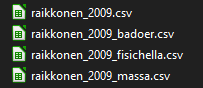
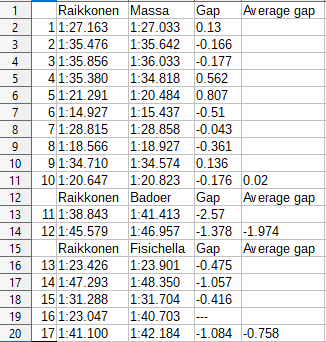

# F1QualifyingVersus
Dumps Formula 1 teammate qualifying battle data from seasons 2003-2021 using Ergast API to .csv files

Supports seasons 2003-2021. The limitation is due to the Ergast API which I am using to get the data.

# Features:
- CMD-interface to choose the driver, the season and the current round.
- Supports different qualifying models. 2003-2004 only had Q1. 2005 had two-lap qualifying.
- Supports drivers retiring from the sport and coming back. E.g Raikkonen 2001-2009 and 2012-2021
- Automatically dumps the data to csv formated files.
  - the files are organized by teammate but they are as well combined into a one single file.





# Installation
[Python 3](https://www.python.org/downloads/) is needed


Download the code from the repository and launch a terminal. Then navigate to the folder where you have installed the code.

After that type:

```
pip install -r requirements.txt
```

Once it's installed launch the main.py from the terminal:

```
python main.py
```

